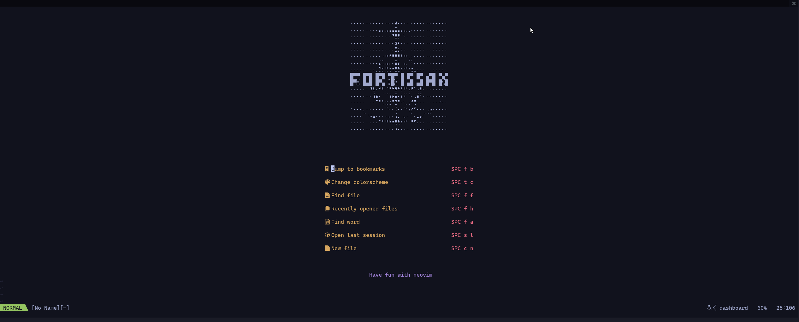
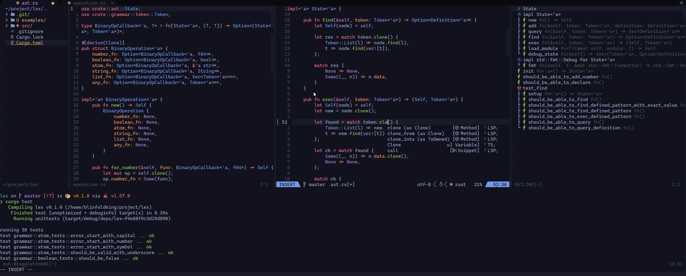

# Fortissax


## About
Modern and general purpose neovim preconfigure distribution, written in lua.

### Features



* Autocomplete
* Git integration
* Language Support
* Tree sitter for syntax highlight
* Language Diagnostic
* Testing
* Debugging (WIP)
* and more

## Installation

requirement:
* neovim >= 0.7
* git
* python3-env
* python3-nvim

after all requirement complete run command below:  
```bash
git clone https://github.com/BlinfoldKing/fortissax.nvim.git ~/.config/nvim
```

after that, compile Fortissax packages by running:  
```bash
nvim --headless -c 'autocmd User PackerComplete quitall' -c 'PackerSync'
```

## Quickstart

if you dont know what to do most of Fortissax can be access by pressing `space` on **NORMAL** mode

### Installing language support

you can install lsp support(required for most fortissax features) for your favorite language by using
```
:LspInstall <package_name>
```
if you are unsure of what the package_name is for your language you can use
```
:LspInstallInfo
```

### Installing Tree Sitter Support

you can install tree sitter for your favorite language by using
```
:TSInstall <package_name>
```
if you are unsure of what the package_name is for your language you can use
```
:TSInstallInfo
```
